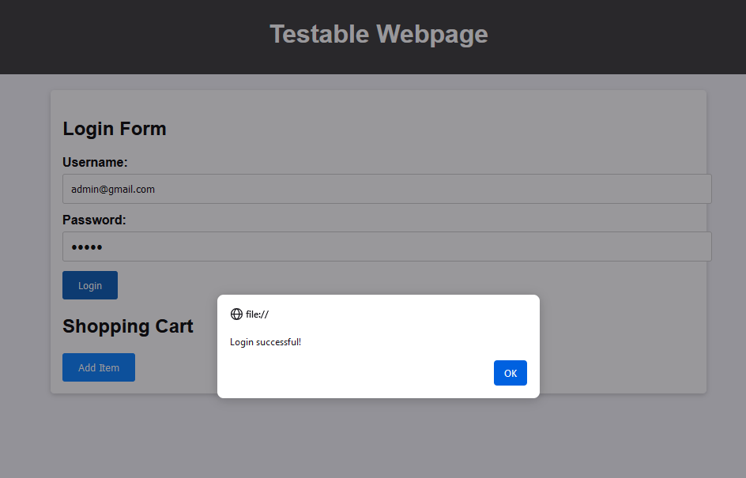
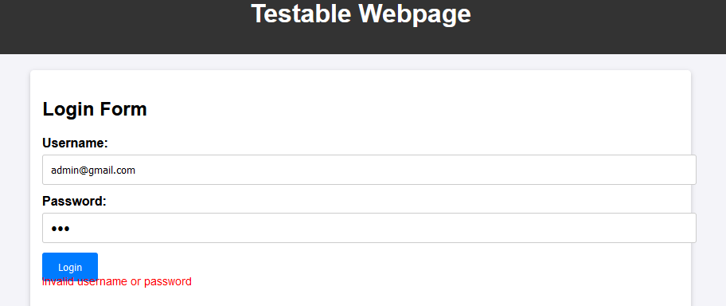
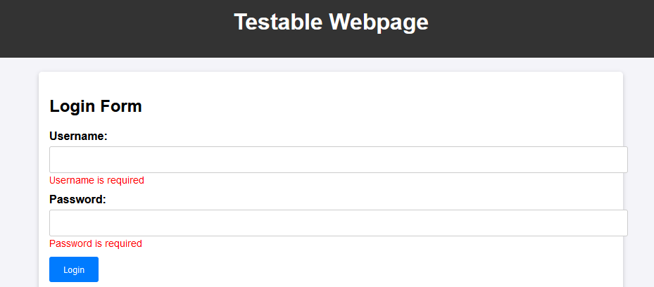

# Przypadki testowe: Logowanie

## TestCase01: Poprawne logowanie
- **Opis**: Sprawdzenie, czy użytkownik może zalogować się prawidłowymi danymi.
- **Kroki**:
  1. Otwórz stronę logowania.
  2. Wprowadź prawidłowy e-mail i hasło.
  3. Kliknij "Zaloguj".
- **Oczekiwany wynik**: Użytkownik zostaje zalogowany i pojawia się okno z informacją o udanym logowaniu.

- 

## TestCase02: Logowanie z błędnym hasłem
- **Opis**: Sprawdzenie, czy system poprawnie reaguje na błędne hasło.
- **Kroki**:
  1. Otwórz stronę logowania.
  2. Wprowadź prawidłowy e-mail i błędne hasło.
  3. Kliknij "Zaloguj".
- **Oczekiwany wynik**: Wyświetlenie komunikatu: "Nieprawidłowe dane logowania".

## TestCase03: Logowanie z pustymi polami
- **Opis**: Sprawdzenie, czy system nie pozwala na logowanie bez wprowadzenia danych.
- **Kroki**:
  1. Otwórz stronę logowania.
  2. Pozostaw oba pola puste.
  3. Kliknij "Zaloguj".
- **Oczekiwany wynik**: Wyświetlenie komunikatu: "Wprowadź e-mail i hasło".

