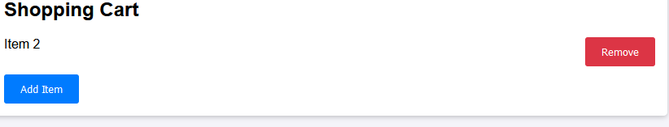
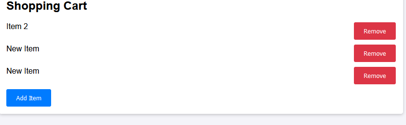

# Przypadki testowe: Koszyk

## TestCase01: Usuwanie przedmiotów
- **Opis**: Sprawdzenie, czy można usunąć przedmioty z koszyka.
- **Kroki**:
  1. Otwórz stronę logowania.
  2. Przewiń na dolną część strony.
  3. Kliknij "Usuń".
- **Oczekiwany wynik**: Przedmiot zostaje usunięty z koszyka.

## TestCase02: Dodawanie przedmiotów 
- **Opis**: Sprawdzenie, czy można dodać przedmioty do koszyka.
- **Kroki**:
  1. Otwórz stronę logowania.
  2. Przewiń na dolną część strony.
  3. Kliknij "Dodaj przedmiot".
- **Oczekiwany wynik**: Przedmiot zostaje dodany do koszyka ".

